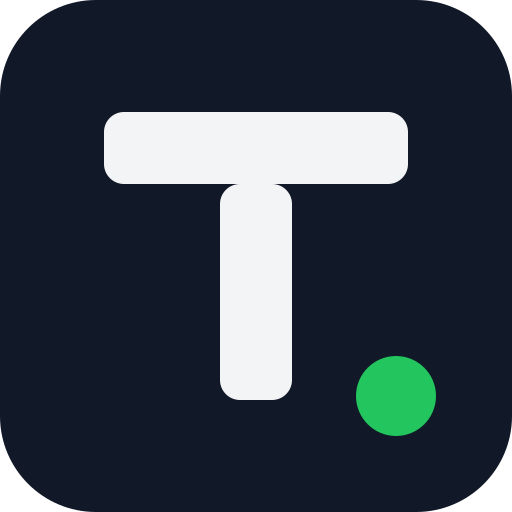

<div align="center">
  

# TEKNIK 0.1

**A mobile-first voxel sandbox prototype built with Godot 4.**

Procedural terrain, mining, block placement, inventory management, touch controls, chunk streaming, and classic voxel-style lighting.

</div>

> **Project status:** Early playable prototype. The current focus is strengthening world generation, performance, mobile usability, and the core survival-building foundation.

## Current Features

- Deterministic procedural voxel terrain generated from a fixed seed.
- Streamed chunks around the player instead of loading the whole world at once.
- Grass, dirt, stone, sand, logs, leaves, and localized water surfaces.
- Deterministic tree generation.
- Block targeting, mining, and placement.
- Mining adds blocks to the inventory; placement consumes the selected stack.
- 36-slot inventory: 9 hotbar slots and 27 storage slots.
- Stack size of up to 64 items.
- Desktop and Android touch controls.
- Classic voxel lighting with directional face shading, vertex ambient occlusion, and skylight reduction through leaves.
- Saved block edits layered over the generated world.
- Gradle-based Android debug and release export presets.
- Automated Godot validation and feature acceptance gates in GitHub Actions.

## Controls

### Desktop

| Action | Input |
|---|---|
| Move | `W`, `A`, `S`, `D` |
| Look | Mouse |
| Jump | `Space` |
| Mine targeted block | Left mouse button |
| Place selected block | Right mouse button |
| Select hotbar slot | `1`–`9` |
| Previous/next hotbar slot | Mouse wheel |
| Open or close inventory | `E` |
| Run current test crafting recipe | `C` |

### Android / Touch

| Action | Input |
|---|---|
| Move | Left virtual joystick |
| Look | Drag on the right side of the screen |
| Jump, mine, place, craft | On-screen action buttons |
| Select hotbar slot | Tap a hotbar slot |
| Open inventory | Tap the `INVENTORY` button |
| Move a full stack | Tap a slot |
| Split or place one item | Long-press a slot |

## Inventory and Crafting

The inventory contains 36 slots in total:

- 9 hotbar slots.
- 27 storage slots.
- Maximum stack size: 64.

The current crafting implementation is a temporary test recipe:

```text
4 Dirt -> 1 Stone
```

It exists to validate inventory transactions and is not the final crafting system.

## World Generation

The active Android world is generated on demand from world coordinates and a fixed seed. The mobile runtime currently uses:

- 12 x 12 horizontal chunks.
- A world height of 30 blocks.
- A render radius of 3 chunks, producing a 7 x 7 visible chunk area.
- A smaller collision radius around the player for mobile performance.
- Height-based grass, dirt, stone, and shoreline sand.
- Deterministic trees and localized water bodies.
- Saved coordinate overrides for mined and placed blocks.

The repository still contains an older desktop-oriented 16 x 16 x 16 chunk implementation. Android activates the optimized playable-world runtime through `playable_world_port.gd`.

See [Architecture](docs/ARCHITECTURE.md) for the exact runtime split.

## Running the Project

The automated workflows are pinned to **Godot 4.3 stable**.

1. Install Godot 4.3.
2. Clone this repository.
3. Import `project.godot` into Godot.
4. Open the project and run the main scene with `F6` or the project with `F5`.

The main scene is:

```text
res://scenes/main.tscn
```

## Android APK Export

The repository includes a manual GitHub Actions workflow:

```text
TEKNIK Step 5 Android APK Export
```

To create a debug APK:

1. Open the repository's **Actions** tab.
2. Select **TEKNIK Step 5 Android APK Export**.
3. Choose **Run workflow** on the desired branch.
4. Download the `teknik-step5-first-apk-export` artifact after the run succeeds.
5. Extract `TEKNIK-0.1-debug.apk` from the artifact archive.

The Android configuration currently targets:

- Minimum SDK: 24.
- Target SDK: 34.
- Architecture: ARM64.
- Export system: Gradle.
- Package ID: `com.wolferdwolf.teknik`.

See [Building and Exporting](docs/BUILDING.md) for details.

## Repository Guide

```text
assets/                 Project icon and visual assets
scenes/                 Godot scenes
scripts/android/        Android keystore/export helpers
scripts/inventory/      Inventory data model
scripts/player/         Movement, targeting, mining, placement, inventory integration
scripts/ui/             Touch controls, hotbar, and inventory screen
scripts/world/          Chunk streaming, world data, meshing, water, and lighting
tests/                  Godot acceptance and regression tests
.github/workflows/      CI gates and manual Android export workflows
```

## Documentation

- [Gameplay](docs/GAMEPLAY.md)
- [Architecture](docs/ARCHITECTURE.md)
- [Building and Exporting](docs/BUILDING.md)
- [Testing](docs/TESTING.md)
- [Project Status](docs/PROJECT_STATUS.md)
- [Contributing](CONTRIBUTING.md)
- [Changelog](CHANGELOG.md)

## Current Limitations

- No production biome system yet.
- No caves, ores, mobs, health, hunger, combat, or survival progression.
- The current world seed is fixed.
- World height is limited to 30 blocks in the active mobile runtime.
- Water is rendered as localized flat surfaces rather than full water voxels.
- Crafting is only a temporary test recipe.
- Visuals use generated colours rather than a finished texture atlas.
- Android release signing is not configured for public distribution.

## Development Discipline

All gameplay changes should be developed on a separate branch, validated by the relevant tests, checked on an Android device when applicable, and merged only after explicit owner approval.

## License

No project license has been declared yet. Until a license is added, reuse, redistribution, and derivative use are not granted by this repository.